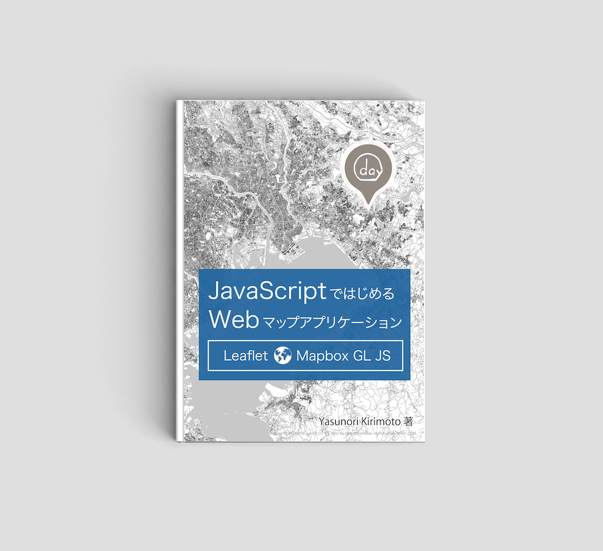
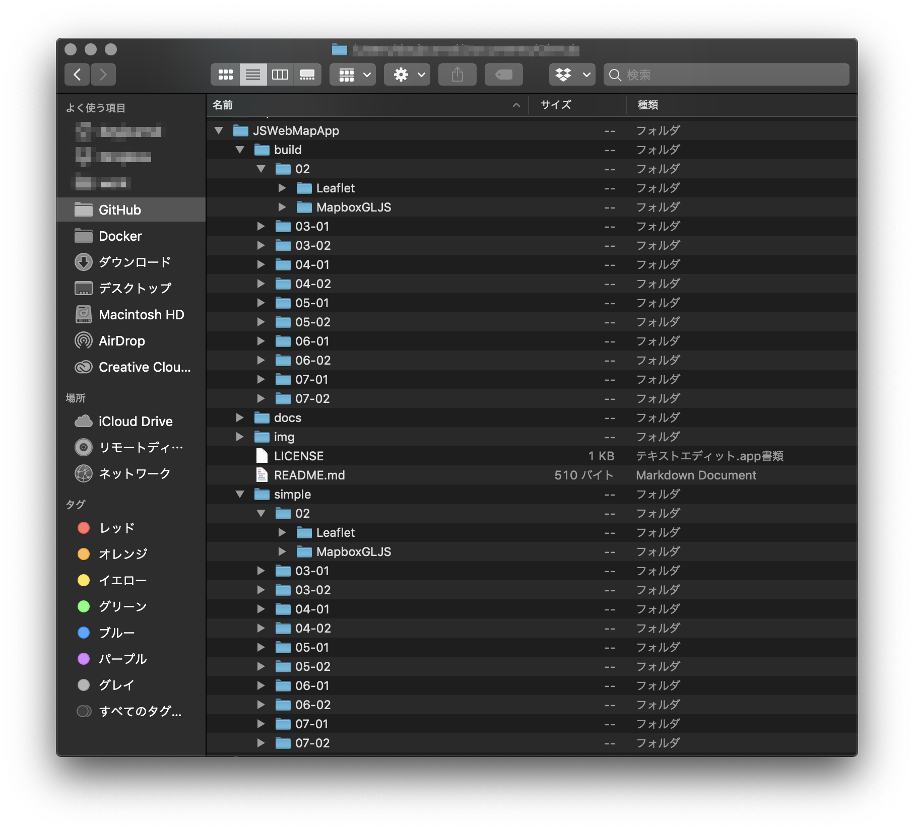
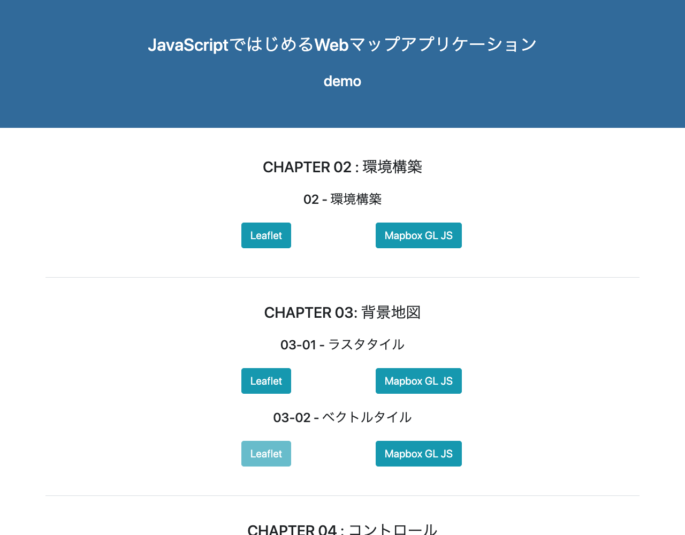

# JSWebMapApp

 

## JavaScriptではじめるWebマップアプリケーション  
技術書典6で販売する書籍のサンプルデータ用のリポジトリです。  

[詳細情報](https://techbookfest.org/event/tbf06/circle/64070001)

 

## サンプル一覧
書籍で紹介しているサンプルデータ一式を格納  

simpleディレクトリ:  
- シンプル環境のサンプルデータ一式格納  

buildディレクトリ:  
- ビルド環境のサンプルデータ一式格納  

利用データ:  
- 室蘭市オープンデータ(CC BY)

 

## デモサイト
書籍で紹介しているサンプルのデモを確認  

[デモサイト](https://dayjournal.github.io/JSWebMapApp)

 

## ライセンス
MIT  

Copyright (c) 2019 Yasunori Kirimoto  

 
